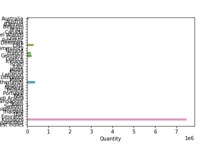
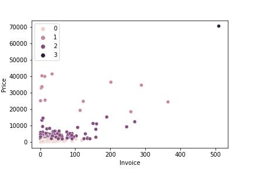
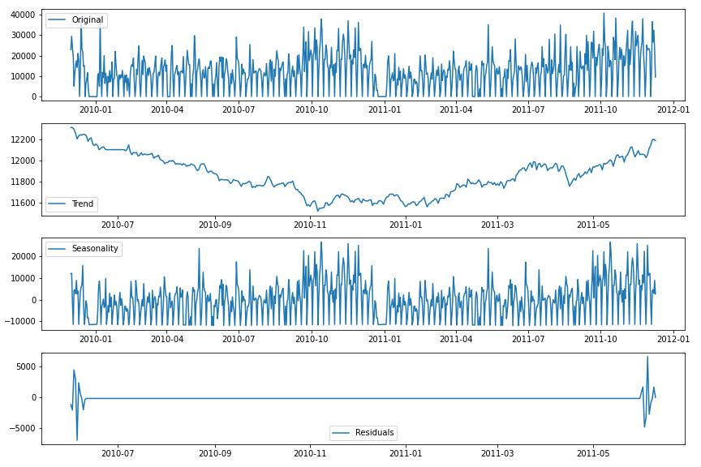
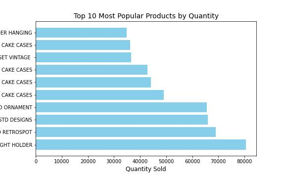
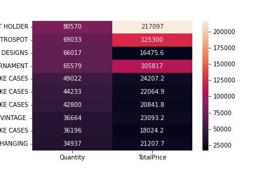
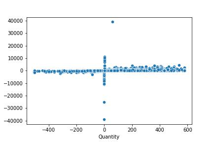
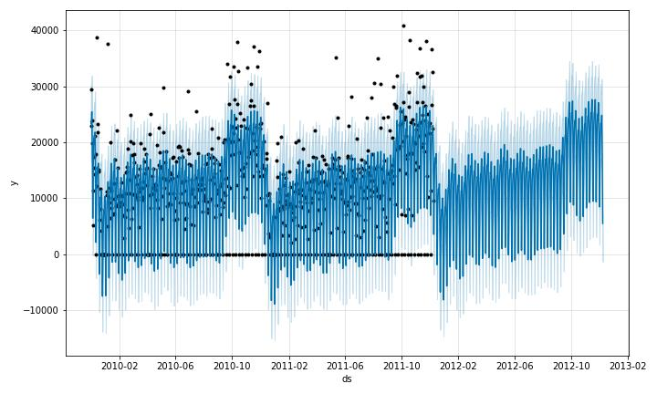
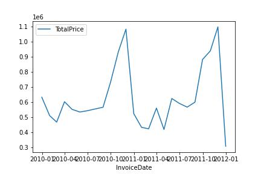
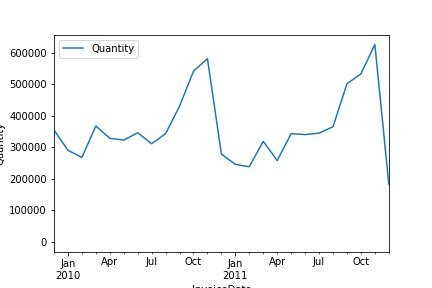
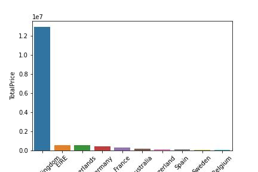

# Retail Sales Data Analysis

This project aims to analyze retail sales data and provide insights on the best-selling products, sales trends over time, and other useful information.

In today's competitive business landscape, having insights into customer purchasing behavior is essential for success. The ability to identify the best-selling products, sales trends over time, and other useful information can give companies a strategic advantage. This project aims to provide just that, by analyzing retail sales data and delivering actionable insights.

The project uses Python and several popular data analysis libraries to provide summary statistics, correlation coefficients, top-selling products by quantity sold, total price per invoice, and time series analysis of sales trends over time. The resulting web application provides an intuitive and interactive interface for exploring the data and uncovering valuable information.

Whether you're a business owner looking to optimize your sales strategy or a data analyst seeking to improve your skills, this project can help you gain valuable insights into retail sales data. So, let's dive in and explore the world of retail sales!

---

## Data Set Information

This Online Retail data set contains all the transactions occurring for a UK-based and registered, non-store online retail between 01/12/2009 and 09/12/2011.The company mainly sells unique all-occasion gift-ware. Many customers of the company are wholesalers.

### Attribute Information:

- **InvoiceNo:** Invoice number. Nominal. A 6-digit integral number uniquely assigned to each transaction. If this code starts with the letter 'c', it indicates a cancellation.

- **StockCode:** Product (item) code. Nominal. A 5-digit integral number uniquely assigned to each distinct product.

- **Description:** Product (item) name. Nominal.

- **Quantity:** The quantities of each product (item) per transaction. Numeric.

- **InvoiceDate:** Invice date and time. Numeric. The day and time when a transaction was generated.

- **UnitPrice:** Unit price. Numeric. Product price per unit in sterling (£).

- **CustomerID:** Customer number. Nominal. A 5-digit integral number uniquely assigned to each customer.

- **Country:** Country name. Nominal. The name of the country where a customer resides.

---

## Project Structure

The project has the following structure:

    - Resources/
        - retail_2009_2010.csv
        - retail_2010_2011.csv
    - app.py
    - README.md

The Resources folder contains the two data files used in the analysis. The app.py file contains the main code for the project. The README.md file (this file) provides an overview of the project and instructions for running the application.

---

## Installation

To run this application, you will need Python 3.9 or higher. You can install the required packages by running the following command:

    pip install -r requirements.txt
    
---

## Running the Application

To run the application, navigate to the project directory in your terminal and run the following command:

    streamlit run app.py
    
This will launch a web application where you can interact with the data analysis.

---

## Purpose and Goals

### Purpose

The primary purpose of this project is to provide a simple but effective way to analyze retail sales data and provide insights into the best-selling products, sales trends over time, and other useful information. The retail industry is a highly competitive and constantly evolving space, and having access to accurate and insightful sales data can be crucial for making informed business decisions. By providing an easy-to-use tool for analyzing this data, this project aims to help businesses and other stakeholders in the retail industry gain a better understanding of their sales performance and identify opportunities for growth and improvement.

### Goals

The main goals of this project can be summarized as follows:

- Provide a user-friendly interface for analyzing retail sales data

- Identify the top-selling products by quantity and revenue

- Analyze sales trends over time to identify seasonal patterns and other trends

- Provide summary statistics and correlation coefficients for the data

- Generate informative and visually appealing charts and graphs to help users interpret the data

By achieving these goals, this project aims to provide a valuable resource for anyone looking to gain insights into the retail sales landscape and make data-driven decisions that can help their business succeed.

---

## Features

The application provides the following features:

- Summary statistics of the data

- Correlation coefficients of the variables

- Top 10 best-selling products by quantity sold

- Total price per invoice

- Time series analysis of sales trends over time

---

## Technologies Used
The following technologies were used in this project:
    
    - Python 3.9
    
    - Pandas
    
    - NumPy
    
    - Matplotlib
    
    - Seaborn
    
    - Streamlit
    
---

## Conclusion
This project provides a simple but powerful way to analyze retail sales data and gain insights into the best-selling products and sales trends over time. With some additional work, this application could be expanded to provide more detailed analysis and visualization of the data.

---

## Glossary

---
